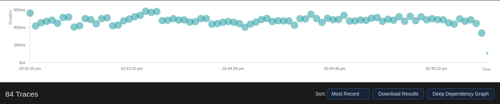
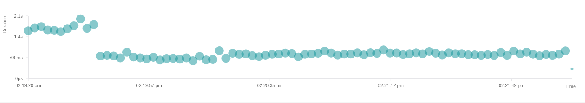

# Kafka Damero

A Spring Boot library that adds automatic retry logic, dead letter queue handling, and circuit breaker support to Kafka listeners. The library reduces boilerplate code and provides production-ready error handling with minimal configuration.

**View Troubleshooting Guide**: [TROUBLESHOOTING.md](TROUBLESHOOTING.md) - Solutions for common issues (deserialization errors, type headers, Redis warnings)

## Status

Beta release. All core features are implemented and tested. The library is functional and ready for testing in development environments. Use in production at your own discretion.

## Library Metrics
Ive benchmarked under loads of 200k messages (batch size 4,000, 1s window), 
the library adds ~0.11–0.15 ms per message of processing overhead (measured via OpenTelemetry/Jaeger).
Initial startup batches may be slightly higher due to JVM warm-up.
See peformancescreenshots further down and also in /peformancescreenshots in the main codebase


## Features

- **batch processing** with two modes: capacity-first (max throughput) and fixed window (predictable timing) - see [BATCH_PROCESSING_GUIDE.md](BatchProcessingLogic.md)
- automatic retry logic with configurable backoff strategies (exponential, linear, fibonacci, custom)
- dead letter queue routing with complete metadata (attempts, timestamps, exceptions)
- distributed tracing with opentelemetry for full visibility into message processing
- circuit breaker integration using resilience4j
- rate limiting to control message processing throughput
- message deduplication to prevent duplicate processing
- conditional dlq routing to send different exceptions to different topics
- rest api for querying and replaying dlq messages
- distributed cache support using redis for multi-instance deployments
- **comprehensive metrics** with micrometer for production monitoring
- crash-safe batch acknowledgments (no data loss on server restart)
- auto-configuration with sensible defaults

## Requirements

- Java 21 or higher
- Spring Boot 3.x
- Spring Kafka
- Apache Kafka

## Installation

add the library to your project:

```xml
<dependency>
    <groupId>java.damero</groupId>
    <artifactId>kafka-damero</artifactId>
    <version>1.0.1</version>
</dependency>
```

the library automatically includes these dependencies:

- spring-boot-starter-aop
- micrometer-core
- resilience4j-circuitbreaker
- caffeine
- reflections
- commons-io

optional: add redis for distributed caching across multiple instances:

```xml
<dependency>
    <groupId>org.springframework.boot</groupId>
    <artifactId>spring-boot-starter-data-redis</artifactId>
</dependency>
```

optional: add opentelemetry for distributed tracing (recommended):

```xml
<dependency>
    <groupId>io.opentelemetry</groupId>
    <artifactId>opentelemetry-sdk</artifactId>
    <version>1.33.0</version>
</dependency>

<dependency>
    <groupId>io.opentelemetry</groupId>
    <artifactId>opentelemetry-exporter-otlp</artifactId>
    <version>1.33.0</version>
</dependency>
```

note: the example-app folder includes a fully configured working example with tracing already set up. copy the OpenTelemetryConfig class from there to get started quickly.

configure kafka in your application.properties:

```properties
spring.kafka.bootstrap-servers=localhost:9092
```

If using Redis:

```properties
spring.data.redis.host=localhost
spring.data.redis.port=6379
```

## Producer requirements

This library provides a consumer-side wrapper. You still need to provide and configure the Kafka producer in your application. The consumer code provided by this library expects to receive the original event object as the message value. To make that work reliably follow these rules:

Checklist for your producer

- Use a JSON value serializer for message bodies. The recommended option is Spring Kafka's JsonSerializer (org.springframework.kafka.support.serializer.JsonSerializer) or any serializer that writes plain JSON bytes.
- Use a string serializer for message keys (org.apache.kafka.common.serialization.StringSerializer) unless you have a specific reason to use another key type.
- Send the raw domain object as the value. Do not wrap the event in a custom envelope unless you also update your consumer to unwrap it.
- Optionally supply a configured Jackson ObjectMapper to the JsonSerializer if you need custom serialization features (timestamps, custom modules, naming strategies).

Why this matters

The library delivers the original event object to your listener method (ConsumerRecord.value()). If the producer sends non-JSON bytes or a custom wrapper, the consumer may not be able to reconstruct the original event type and casting at the listener will fail. Using a standard JsonSerializer ensures the message payload is readable by the consumer and keeps behavior predictable.

Quick examples

1) Spring Boot Java configuration (recommended)

```java
@Configuration
public class KafkaProducerConfig {

    @Bean
    public ProducerFactory<String, Object> producerFactory(ObjectMapper objectMapper) {
        Map<String, Object> props = new HashMap<>();
        props.put(ProducerConfig.BOOTSTRAP_SERVERS_CONFIG, "${spring.kafka.bootstrap-servers}");
        props.put(ProducerConfig.KEY_SERIALIZER_CLASS_CONFIG, StringSerializer.class);
        props.put(ProducerConfig.VALUE_SERIALIZER_CLASS_CONFIG, JsonSerializer.class);

        DefaultKafkaProducerFactory<String, Object> factory = new DefaultKafkaProducerFactory<>(props);
        // If you want to use a custom ObjectMapper, provide it to the JsonSerializer
        factory.setValueSerializer(new JsonSerializer<>(objectMapper));
        return factory;
    }

    @Bean
    public KafkaTemplate<String, Object> kafkaTemplate(ProducerFactory<String, Object> producerFactory) {
        return new KafkaTemplate<>(producerFactory);
    }
}
```

Sending a message from your application:

```java
@Service
public class OrderProducer {

    private final KafkaTemplate<String, Object> kafkaTemplate;

    public OrderProducer(KafkaTemplate<String, Object> kafkaTemplate) {
        this.kafkaTemplate = kafkaTemplate;
    }

    public void sendOrder(String key, OrderEvent order) {
        kafkaTemplate.send("orders", key, order);
    }
}
```

2) application.properties example

```properties
spring.kafka.producer.bootstrap-servers=localhost:9092
spring.kafka.producer.key-serializer=org.apache.kafka.common.serialization.StringSerializer
spring.kafka.producer.value-serializer=org.springframework.kafka.support.serializer.JsonSerializer
```

Notes and advanced tips

- If you need to send messages to the library's DLQ topics manually, send the same domain object as the original producer would. The library expects DLQ entries to contain the original event when replaying or manual inspection is needed.
- If you use custom headers or type information, make sure they are compatible with your serializer and with any consumer configuration you use outside of this library.
- The example-app subproject contains a working producer and consumer setup. Use it as a reference if you want a full working example.

## Quick Start

Create a listener with the @DameroKafkaListener annotation:

```java
@Service
public class OrderListener {
    
    @DameroKafkaListener(
        topic = "orders",
        dlqTopic = "orders-dlq",
        maxAttempts = 3,
        delay = 1000,
        delayMethod = DelayMethod.EXPO,
        openTelemetry = true  // optional: enable distributed tracing
    )
    @KafkaListener(
        topics = "orders",
        groupId = "order-processor",
        containerFactory = "kafkaListenerContainerFactory"
    )
    public void processOrder(ConsumerRecord<String, Object> record, Acknowledgment ack) {
        OrderEvent order = (OrderEvent) record.value();
        
        // process the order
        processPayment(order);
        
        ack.acknowledge();
    }
}
```

the library handles retries, dlq routing, and acknowledgment automatically. if you enable tracing (opentelemetry = true), you also get full visibility into message processing with zero additional code.

## Batch Processing

process thousands of messages efficiently with built-in batch processing. the library handles batching, acknowledgments, and crash recovery automatically.

### why use batch processing

batch processing can dramatically improve throughput when you need to process many messages:

- **10x-50x faster throughput** compared to single message processing
- automatic handling of batch collection and acknowledgments
- crash-safe with no data loss (messages are only acknowledged after successful processing)
- two modes: capacity-first (maximum speed) and fixed window (predictable timing)
- comprehensive metrics to monitor batch performance
- works with all other features (retries, dlq, circuit breaker, deduplication)

### basic usage

just add batch configuration to your existing listener:

```java
@DameroKafkaListener(
    topic = "orders",
    dlqTopic = "orders-dlq",
    maxAttempts = 3,
    batchCapacity = 1000,          // process when 1000 messages collected
    batchWindowLength = 5000       // or every 5 seconds (whichever comes first)
)
@KafkaListener(topics = "orders", groupId = "order-processor")
public void processOrder(ConsumerRecord<String, Object> record, Acknowledgment ack) {
    // your existing code works without changes
    OrderEvent order = (OrderEvent) record.value();
    processPayment(order);
    // library handles acknowledgment after entire batch completes
}
```

that is it. your method signature stays the same. the library batches messages and calls your method for each one. all messages are acknowledged together after the batch completes.

### batch modes explained

**capacity-first mode (default)**

processes batches as soon as they reach the capacity limit. best for maximum throughput.

```java
@DameroKafkaListener(
    topic = "analytics-events",
    batchCapacity = 5000,          // process immediately when 5000 messages arrive
    batchWindowLength = 10000,     // or every 10 seconds if messages are slow
    fixedWindow = false            // capacity-first mode (default)
)
```

use this when you want maximum speed and can handle variable batch timing.

**fixed window mode**

processes batches only when the time window expires. best for predictable timing and rate limiting.

```java
@DameroKafkaListener(
    topic = "external-api",
    batchCapacity = 100,           // maximum 100 messages per batch
    batchWindowLength = 60000,     // strict 60 second intervals
    fixedWindow = true             // fixed window mode
)
```

use this when you need to respect rate limits or want consistent batch timing. if more than 100 messages arrive in 60 seconds, the extra messages wait for the next window (natural backpressure).

### performance comparison

tested with 75,000 messages on a standard laptop:

| mode | batch size | throughput | time per message |
|------|------------|------------|------------------|
| single message | 1 | 5,000/sec | 1.2 ms |
| capacity-first | 1,000 | 40,000/sec | 0.5 ms |
| capacity-first | 5,000 | 150,000/sec | 0.3 ms |
| fixed window | 4,000 | 120,000/sec | 0.4 ms |


### real-world performance with distributed tracing

the image below shows actual batch processing with full opentelemetry tracing enabled. this is around 83 batches processing 6,000 messages each (500,000 total messages) with complete distributed tracing overhead included:
The high response time at the start is due to the kafka consumer starting up and jvm warming up.
Batches settle around 750ms (12.5ms per message) and is consistent the whole time.

**key metrics from this run:**
- **average batch duration**: ~ 750 seconds per 6,000 message batch
- **throughput**: ~3,300 messages/second
- **overhead per message**: approximately .3ms including full distributed tracing

this demonstrates that even with the overhead of creating and exporting thousands of opentelemetry spans, the library maintains excellent performance. the 0.3ms overhead per message is minimal and gives you complete visibility into your message processing pipeline - you can trace every message from producer to consumer through retries and dlq routing.

for comparison, without tracing enabled, you can achieve even higher throughput (150,000+ messages/sec as shown in the table above). the choice depends on whether you need full observability in production.

### vs spring batch

spring batch is a different tool for different use cases. here is when to use each:

**use kafka-damero batch processing when:**

- you are already using kafka and want faster message processing
- you want simple configuration (just add two parameters to your annotation)
- you need real-time or near real-time processing
- you want automatic retry and dlq handling per message
- setup takes 2 minutes with zero infrastructure

**use spring batch when:**

- you are processing data from files or databases (not kafka)
- you need complex job orchestration and scheduling
- you need chunk-based transaction management
- you want job restart and recovery features
- you are doing batch jobs that run on schedules (nightly reports, etc)

**key differences:**

| feature | kafka-damero | spring batch |
|---------|--------------|--------------|
| setup complexity | add 2 config parameters | create job, step, reader, writer, processor |
| kafka integration | built-in | requires custom itemreader |
| message retries | automatic per message | manual configuration |
| dlq handling | automatic | custom implementation needed |
| crash recovery | automatic (kafka offsets) | requires database and job repository |
| configuration | annotation-based | xml or java config classes |
| learning curve | 5 minutes | hours to days |
| infrastructure | just kafka | kafka + database for job repository |

### crash safety

batch processing is crash-safe by design. messages are only acknowledged after the entire batch completes successfully:

1. batch collects 1000 messages
2. library processes all messages in the batch
3. failed messages go to dlq with retry logic
4. successful messages are acknowledged together
5. server crashes before step 4 means messages will be redelivered

this prevents data loss while maintaining high throughput.

### monitoring batches

the library provides detailed metrics for batch processing:

```
kafka.damero.batch.size                    # histogram of batch sizes
kafka.damero.batch.processing.time         # total batch processing duration
kafka.damero.batch.time.per.message        # average time per message
kafka.damero.batch.capacity.reached        # batches triggered by capacity
kafka.damero.batch.window.expired          # batches triggered by timer
kafka.damero.batch.backpressure            # messages rejected (fixed window only)
```

these metrics help you tune batch size and window length for optimal performance.

### complete example

here is a real-world example processing order events:

```java
@Service
public class OrderBatchProcessor {
    
    @DameroKafkaListener(
        topic = "orders",
        dlqTopic = "orders-dlq",
        
        // batch settings
        batchCapacity = 2000,
        batchWindowLength = 5000,
        minimumCapacity = 1000,      // optional: trigger early at 1000 messages
        
        // other features work together
        maxAttempts = 3,
        delayMethod = DelayMethod.EXPO,
        deDuplication = true,
        enableCircuitBreaker = true,
        openTelemetry = true
    )
    @KafkaListener(topics = "orders", groupId = "order-processor")
    public void processOrder(ConsumerRecord<String, OrderEvent> record, Acknowledgment ack) {
        OrderEvent order = record.value();
        
        // your business logic
        validateOrder(order);
        updateInventory(order);
        processPayment(order);
        
        // library handles acknowledgment after batch completes
    }
}
```

this configuration processes up to 2000 orders at once with automatic retries, deduplication, circuit breaker protection, and full distributed tracing.

for more details including troubleshooting and advanced configuration, see [BATCH_PROCESSING_GUIDE.md](BatchProcessingLogic.md).

## Configuration

### Annotation Parameters

The @DameroKafkaListener annotation supports these parameters:

| Parameter | Type | Default | Description |
|-----------|------|---------|-------------|
| topic | String | Required | Topic to consume from |
| dlqTopic | String | "" | Dead letter queue topic |
| maxAttempts | int | 3 | Maximum retry attempts |
| delay | double | 0.0 | Base delay in milliseconds |
| delayMethod | DelayMethod | EXPO | Retry backoff strategy |
| fibonacciLimit | int | 15 | Maximum Fibonacci sequence index |
| nonRetryableExceptions | Class[] | {} | Exceptions that skip retries |
| dlqRoutes | DlqExceptionRoutes[] | {} | Route specific exceptions to different DLQ topics |
| enableCircuitBreaker | boolean | false | Enable circuit breaker |
| circuitBreakerFailureThreshold | int | 50 | Failures before opening circuit |
| circuitBreakerWindowDuration | long | 60000 | Failure tracking window in ms |
| circuitBreakerWaitDuration | long | 60000 | Wait time before half-open in ms |
| messagesPerWindow | int | 0 | rate limit: messages per window (0 = disabled) |
| messageWindow | long | 0 | rate limit: window duration in ms |
| deDuplication | boolean | false | enable message deduplication |
| openTelemetry | boolean | false | enable distributed tracing |
| **batchCapacity** | **int** | **0** | **batch: max messages per batch (0 = disabled)** |
| **batchWindowLength** | **int** | **0** | **batch: max time to wait in ms** |
| **minimumCapacity** | **int** | **0** | **batch: optional early trigger threshold** |
| **fixedWindow** | **boolean** | **false** | **batch: true = fixed timing, false = max speed** |

### Delay Methods

| Method | Formula | Example (delay=1000ms) |
|--------|---------|------------------------|
| EXPO | delay * 2^attempt | 1s, 2s, 4s, 8s |
| LINEAR | delay * attempt | 1s, 2s, 3s, 4s |
| FIBONACCI | Fibonacci sequence * delay | 1s, 1s, 2s, 3s, 5s |
| MAX | Fixed delay | 1s, 1s, 1s, 1s |

### Redis Configuration

The library uses Caffeine in-memory cache by default. For multi-instance deployments, add Redis:

1. Add spring-boot-starter-data-redis dependency
2. Configure Redis connection in application.properties

The library automatically detects Redis and uses it for distributed caching. If Redis becomes unavailable during runtime, all cache operations gracefully degrade:

- Cache writes fail silently without crashing the application
- Cache reads return false/null, which may cause duplicate processing
- Your application continues processing messages normally

This prevents Redis outages from bringing down your Kafka consumers. However, during a Redis outage, deduplication and retry tracking will not work across instances.

## How It Works

When a message fails processing:

1. The library checks if the exception is non-retryable
2. Non-retryable exceptions go directly to the DLQ
3. Retryable exceptions are checked against the max attempts limit
4. If max attempts reached, the message goes to DLQ with full metadata
5. Otherwise, the message is scheduled for retry based on the delay method
6. After the delay, the message is resent to the original topic
7. Retry metadata is stored in Kafka headers
8. The process repeats until success or max attempts reached

Key points:

- Retries happen by resending to the original topic, not by re-consuming
- Messages are acknowledged only after success or max retries
- DLQ messages include complete retry history
- Your listener receives the original event type, not a wrapper
- EventWrapper is only used for DLQ messages

## Auto-Configuration

The library auto-configures all necessary beans. You can override any bean by defining your own with the same name.

Key auto-configured beans:

- kafkaObjectMapper: JSON serialization with Java Time and polymorphic type support
- defaultKafkaTemplate: For sending messages to DLQ
- kafkaListenerContainerFactory: Container factory for listeners
- dlqKafkaListenerContainerFactory: Container factory for DLQ listeners
- pluggableRedisCache: Cache for retry tracking (Redis if available, otherwise Caffeine)
- kafkaListenerAspect: Intercepts @DameroKafkaListener methods
- retryOrchestrator: Manages retry logic
- dlqRouter: Routes messages to DLQ
- metricsRecorder: Tracks metrics if Micrometer is available

To disable auto-configuration:

```properties
custom.kafka.auto-config.enabled=false
```

## DLQ REST API

The library provides REST endpoints to query and replay DLQ messages.

### Available Endpoints

```
GET  /dlq?topic={dlq-topic}         # Enhanced view with statistics
GET  /dlq/stats?topic={dlq-topic}   # Statistics only
GET  /dlq/raw?topic={dlq-topic}     # Raw EventWrapper format
POST /dlq/replay/{topic}            # Replay messages to original topic
```

### Query Parameters for Replay

- forceReplay: If true, replays all messages from beginning. If false (default), only replays unprocessed messages.
- skipValidation: If true, adds X-Replay-Mode header to skip validation for testing with invalid data.

### Example Usage

```bash
# Query DLQ messages
curl http://localhost:8080/dlq?topic=orders-dlq

# Get statistics
curl http://localhost:8080/dlq/stats?topic=orders-dlq

# Replay messages
curl -X POST http://localhost:8080/dlq/replay/orders-dlq

# Force replay all messages
curl -X POST "http://localhost:8080/dlq/replay/orders-dlq?forceReplay=true"

# Replay with validation skipped
curl -X POST "http://localhost:8080/dlq/replay/orders-dlq?skipValidation=true"
```

The enhanced endpoint provides human-readable timestamps, calculated durations, severity classification (HIGH/MEDIUM/LOW based on failure count), exception type breakdown, and aggregate statistics.

## EventWrapper Structure

Messages in the DLQ are wrapped with metadata:

```java
public class EventWrapper<T> {
    private T event;                    // Your original event
    private LocalDateTime timestamp;    // When sent to DLQ
    private EventMetadata metadata;     // Retry information
}

public class EventMetadata {
    private LocalDateTime firstFailureDateTime;
    private LocalDateTime lastFailureDateTime;
    private int attempts;
    private String originalTopic;
    private String dlqTopic;
    private Exception firstFailureException;
    private Exception lastFailureException;
}
```

## Conditional DLQ Routing

Route different exceptions to different DLQ topics:

```java
@DameroKafkaListener(
    topic = "orders",
    dlqRoutes = {
        @DlqExceptionRoutes(
            exception = ValidationException.class,
            dlqExceptionTopic = "orders-validation-dlq",
            skipRetry = true
        ),
        @DlqExceptionRoutes(
            exception = TimeoutException.class,
            dlqExceptionTopic = "orders-timeout-dlq",
            skipRetry = false
        )
    }
)
```

Use skipRetry=true for validation errors that should not be retried. Use skipRetry=false for transient errors that should retry first.

## Advanced Features

### Rate Limiting

Limit message processing throughput:

```java
@DameroKafkaListener(
    topic = "orders",
    messagesPerWindow = 100,
    messageWindow = 60000  // 100 messages per minute
)
```

### Deduplication

Prevent duplicate message processing:

```java
@DameroKafkaListener(
    topic = "orders",
    deDuplication = true
)
```

The library uses message keys or content hashing to detect duplicates. Deduplication state is stored in the cache (Redis or Caffeine) with automatic expiration.

Configure deduplication settings in application.properties:

```properties
custom.kafka.deduplication.enabled=true
custom.kafka.deduplication.window-duration=10
custom.kafka.deduplication.window-unit=HOURS
custom.kafka.deduplication.num-buckets=1000
custom.kafka.deduplication.max-entries-per-bucket=50000
```

### Circuit Breaker

Protect downstream services:

```java
@DameroKafkaListener(
    topic = "orders",
    enableCircuitBreaker = true,
    circuitBreakerFailureThreshold = 50,
    circuitBreakerWindowDuration = 60000,
    circuitBreakerWaitDuration = 60000
)
```

When the circuit opens, messages go to directly to DLQ without retries.

### Distributed Tracing with OpenTelemetry

the library has built-in distributed tracing that lets you see exactly what happens to each message. this includes retries, dlq routing, circuit breaker events, deduplication checks, and rate limiting. the best part is that the library handles all the tracing automatically. you just need to add a simple configuration class.

#### why use tracing

tracing gives you complete visibility into your kafka message processing:

- see the full journey of each message from consumption to success or dlq
- track how many times a message was retried and why
- identify slow operations and bottlenecks
- correlate errors across multiple services
- monitor circuit breaker behavior and deduplication effectiveness
- debug production issues faster with detailed context

#### how easy is it to setup

the library does all the hard work for you. you only need to:

1. add opentelemetry dependencies to your pom.xml
2. create one simple configuration class (OpenTelemetryConfig)
3. enable tracing in your listener annotation

that is it. the library automatically creates spans for all operations and propagates trace context through kafka headers.

#### step 1: add dependencies

add these to your pom.xml:

```xml
<dependency>
    <groupId>io.opentelemetry</groupId>
    <artifactId>opentelemetry-sdk</artifactId>
    <version>1.33.0</version>
</dependency>

<dependency>
    <groupId>io.opentelemetry</groupId>
    <artifactId>opentelemetry-exporter-otlp</artifactId>
    <version>1.33.0</version>
</dependency>

<dependency>
    <groupId>io.opentelemetry.semconv</groupId>
    <artifactId>opentelemetry-semconv</artifactId>
    <version>1.23.1-alpha</version>
</dependency>
```

#### step 2: create opentelemetryconfig class

create this simple configuration class. the library will automatically use it:

```java
@Configuration
@ConditionalOnProperty(
    name = "otel.tracing.enabled",
    havingValue = "true",
    matchIfMissing = false
)
public class OpenTelemetryConfig {

    @Value("${otel.exporter.otlp.endpoint:http://localhost:4317}")
    private String otlpEndpoint;

    @Value("${otel.service.name:my-service}")
    private String serviceName;

    @Bean
    public OpenTelemetry openTelemetry() {
        Resource resource = Resource.getDefault()
            .merge(Resource.create(Attributes.of(
                ResourceAttributes.SERVICE_NAME, serviceName,
                ResourceAttributes.SERVICE_VERSION, "1.0.0"
            )));

        OtlpGrpcSpanExporter spanExporter = OtlpGrpcSpanExporter.builder()
            .setEndpoint(otlpEndpoint)
            .build();

        SdkTracerProvider sdkTracerProvider = SdkTracerProvider.builder()
            .addSpanProcessor(BatchSpanProcessor.builder(spanExporter).build())
            .setResource(resource)
            .build();

        return OpenTelemetrySdk.builder()
            .setTracerProvider(sdkTracerProvider)
            .setPropagators(ContextPropagators.create(
                W3CTraceContextPropagator.getInstance()
            ))
            .buildAndRegisterGlobal();
    }
}
```

#### step 3: configure in application.properties

```properties
# enable tracing
otel.tracing.enabled=true

# your service name in traces
otel.service.name=my-kafka-service

# where to send traces (jaeger, tempo, cloud provider, etc)
otel.exporter.otlp.endpoint=http://localhost:4317
```

#### step 4: enable in your listener

```java
@DameroKafkaListener(
    topic = "orders",
    dlqTopic = "orders-dlq",
    maxAttempts = 3,
    openTelemetry = true  // just add this
)
@KafkaListener(topics = "orders")
public void processOrder(ConsumerRecord<String, Order> record) {
    // your code
}
```

#### step 5: start a tracing backend and view traces

for local development, start jaeger:

```bash
docker run -d --name jaeger -e collector_otlp_enabled=true \
  -p 16686:16686 -p 4317:4317 jaegertracing/all-in-one:latest
```

then view traces at http://localhost:16686

#### what gets traced automatically

the library automatically creates trace spans for:

- message processing (with success or failure status)
- retry scheduling and execution (with attempt numbers and delays)
- dlq routing (with reason and exception details)
- circuit breaker state changes (open, closed, half-open)
- deduplication checks (duplicate detected or first-time message)
- rate limiting operations (throttled or not)
- conditional dlq routing (which route was matched)

each span includes rich attributes like topic name, event id, retry attempt number, exception type, and more.

#### works with any tracing backend

because the library uses otlp (opentelemetry protocol), it works with any compatible backend:

- jaeger (local development)
- grafana tempo
- aws x-ray
- google cloud trace
- azure monitor
- datadog
- new relic
- honeycomb
- lightstep

you only need to change the endpoint in application.properties. the library code stays the same.

#### production configuration

for production, add sampling to reduce overhead:

```java
@Value("${otel.traces.sampler.ratio:0.01}")  // sample 1% of traces
private double samplerRatio;

SdkTracerProvider sdkTracerProvider = SdkTracerProvider.builder()
    .setSampler(Sampler.traceIdRatioBased(samplerRatio))  // add this
    .addSpanProcessor(...)
    .build();
```

```properties
# sample only 1% of traces in production
otel.traces.sampler.ratio=0.01

# sample 10% in staging
otel.traces.sampler.ratio=0.1

# sample 100% in development
otel.traces.sampler.ratio=1.0
```

#### example trace flow

when you send a message that fails and retries, you will see:

```
trace: a1b2c3d4e5f6...

damero.kafka.process [450ms] failed
  - messaging.destination: orders
  - damero.event_id: order-123
  - damero.outcome: retry_scheduled
  - damero.exception.type: timeoutexception

  damero.rate_limit [0ms] success
    - damero.rate_limit.throttled: false

  damero.deduplication.check [2ms] success
    - damero.deduplication.is_duplicate: false

  damero.retry [5ms] success
    - damero.retry.attempt: 1
    - damero.retry.delay_ms: 1000

(after retry delay...)

damero.kafka.process [350ms] failed
  - damero.retry.attempt: 2
  
  damero.retry [5ms] success
    - damero.retry.attempt: 2

(after retry delay...)

damero.kafka.process [400ms] failed
  - damero.retry.attempt: 3
  
  damero.dlq.route [25ms] success
    - damero.dlq.reason: max_attempts_reached
    - damero.dlq.attempts: 3
```

all spans share the same trace id so you can see the complete story.

#### see more

for detailed setup instructions and backend examples, see:
- viewing_traces.md - complete guide with all backends
- tracing_implementation.md - technical details
- backend_compatibility.md - examples for jaeger, tempo, aws, gcp, azure, etc.

### Metrics

The library automatically records metrics if Micrometer is available:

- kafka.damero.processing.time: Processing time per message
- kafka.damero.processing.count: Success and failure counts
- kafka.damero.exception.count: Exception counts by type
- kafka.damero.retry.count: Retry attempts by topic

Metrics include tags for topic, status, exception type, and attempt number.

## Best Practices

### Max Attempts

- Transient failures (network issues): 3-5 attempts
- External API calls: 3-4 attempts with exponential backoff
- Database connections: 2-3 attempts with linear backoff

### Delays

- Fast retries for brief outages: 100-500ms base delay
- External services: 1000-2000ms base delay
- Rate limited APIs: 5000ms+ with exponential backoff

### Non-Retryable Exceptions

Mark validation and business logic errors as non-retryable:

```java
@DameroKafkaListener(
    topic = "orders",
    nonRetryableExceptions = {
        IllegalArgumentException.class,
        ValidationException.class
    }
)
```

These go directly to DLQ for manual review.

### Manual Acknowledgment

Always use manual acknowledgment mode:

```java
public void processOrder(ConsumerRecord<String, Object> record, Acknowledgment ack) {
    // process message
    ack.acknowledge();
}
```

the library handles acknowledgment timing to prevent duplicate processing.

### Distributed Tracing

enable tracing in development to understand message flow:

```java
@DameroKafkaListener(
    topic = "orders",
    openTelemetry = true  // see exactly what happens to each message
)
```

in production, use sampling to reduce overhead:

```properties
otel.traces.sampler.ratio=0.01  # trace 1% of messages
```

tracing helps you debug issues faster by showing the complete journey of failed messages including all retry attempts and the final outcome.

## Troubleshooting

### Messages retry infinitely

Ensure manual acknowledgment mode is enabled and your listener includes the Acknowledgment parameter.

### Cannot deserialize DLQ messages

Use the dlqKafkaListenerContainerFactory for DLQ listeners. It handles EventWrapper deserialization.

### Auto-configuration not working

Check that custom.kafka.auto-config.enabled is not set to false. Verify your application scans the correct packages.

## Contributing

Contributions are welcome. Submit issues and pull requests on GitHub.

Areas for contribution:

- Additional retry strategies
- Performance optimizations
- Enhanced documentation
- Production readiness improvements
- Bug fixes and tests

## License

See LICENSE file for details.
## migrating from spring retry

if you are currently using spring retry with kafka listeners, here is how to migrate to damero.

### what damero adds over spring retry

spring retry is great for basic retry logic, but it was not built specifically for kafka:

**spring retry limitations:**
- no built-in dlq support for kafka
- no retry metadata in kafka headers
- no conditional dlq routing by exception type
- no circuit breaker integration
- no deduplication support
- no distributed tracing for kafka flows
- no dlq replay api

**damero advantages:**
- kafka-specific retry with header propagation
- automatic dlq routing with full context
- conditional dlq routing per exception type
- built-in circuit breaker for kafka listeners
- message deduplication across instances
- opentelemetry tracing for kafka flows
- rest api to query and replay dlq messages

### migration steps

#### step 1: replace spring retry annotation

**before (spring retry):**
```java
@Retryable(
    value = {TimeoutException.class},
    maxAttempts = 3,
    backoff = @Backoff(delay = 1000, multiplier = 2)
)
@KafkaListener(topics = "orders")
public void processOrder(Order order) {
    // processing logic
}

@Recover
public void recoverOrder(TimeoutException e, Order order) {
    // send to dlq manually
    dlqTemplate.send("orders-dlq", order);
}
```

**after (damero):**
```java
@DameroKafkaListener(
    topic = "orders",
    dlqTopic = "orders-dlq",
    maxAttempts = 3,
    delay = 1000,
    delayMethod = DelayMethod.EXPO
)
@KafkaListener(topics = "orders")
public void processOrder(ConsumerRecord<String, Order> record, Acknowledgment ack) {
    Order order = record.value();
    // processing logic
    ack.acknowledge();
}
```

no need for @Recover method. damero handles dlq routing automatically.

#### step 2: add manual acknowledgment

spring retry works with auto-commit. damero requires manual acknowledgment for reliability:

```properties
# add to application.properties
spring.kafka.listener.ack-mode=manual
```

update your listener signature:
```java
public void processOrder(ConsumerRecord<String, Order> record, Acknowledgment ack) {
    // process
    ack.acknowledge();
}
```

#### step 3: configure retry behavior

**spring retry backoff mapping:**

| spring retry | damero equivalent |
|-------------|-------------------|
| @Backoff(delay = 1000, multiplier = 2) | delay = 1000, delayMethod = DelayMethod.EXPO |
| @Backoff(delay = 1000, multiplier = 1) | delay = 1000, delayMethod = DelayMethod.LINEAR |
| @Backoff(delay = 1000) | delay = 1000, delayMethod = DelayMethod.MAX |

**spring retry exception handling:**

```java
// spring retry
@Retryable(
    value = {TimeoutException.class},
    noRetryFor = {ValidationException.class}
)
```

becomes:

```java
// damero
@DameroKafkaListener(
    topic = "orders",
    nonRetryableExceptions = {ValidationException.class}
)
```

#### step 4: handle conditional dlq routing

if you were manually routing different exceptions to different topics:

**before:**
```java
@Recover
public void recover(ValidationException e, Order order) {
    dlqTemplate.send("orders-validation-dlq", order);
}

@Recover
public void recover(TimeoutException e, Order order) {
    dlqTemplate.send("orders-timeout-dlq", order);
}
```

**after:**
```java
@DameroKafkaListener(
    topic = "orders",
    dlqRoutes = {
        @DlqExceptionRoutes(
            exception = ValidationException.class,
            dlqExceptionTopic = "orders-validation-dlq",
            skipRetry = true
        ),
        @DlqExceptionRoutes(
            exception = TimeoutException.class,
            dlqExceptionTopic = "orders-timeout-dlq",
            skipRetry = false
        )
    }
)
```

#### step 5: remove spring retry dependencies

remove from pom.xml:
```xml
<!-- remove these -->
<dependency>
    <groupId>org.springframework.retry</groupId>
    <artifactId>spring-retry</artifactId>
</dependency>
<dependency>
    <groupId>org.springframework</groupId>
    <artifactId>spring-aspects</artifactId>
</dependency>
```

remove from configuration:
```java
// remove @EnableRetry from your config class
@EnableRetry  // remove this
@Configuration
public class KafkaConfig {
    // ...
}
```

#### step 6: add damero dependency

```xml
<dependency>
    <groupId>java.damero</groupId>
    <artifactId>kafka-damero</artifactId>
    <version>0.1.0-SNAPSHOT</version>
</dependency>
```

### migration checklist

- [ ] replace @Retryable with @DameroKafkaListener
- [ ] remove @Recover methods
- [ ] enable manual acknowledgment mode
- [ ] update listener signatures to include Acknowledgment
- [ ] map backoff strategies to delay methods
- [ ] configure nonRetryableExceptions if needed
- [ ] set up conditional dlq routing if needed
- [ ] remove spring retry dependencies
- [ ] remove @EnableRetry annotation
- [ ] test with low-volume traffic first
- [ ] monitor dlq topics for correct routing
- [ ] verify retry counts in kafka headers
- [ ] check that max attempts are respected

### common migration issues

**issue: messages not being retried**

check that:
- manual ack mode is enabled: `spring.kafka.listener.ack-mode=manual`
- your listener has Acknowledgment parameter
- you call `ack.acknowledge()` after processing

**issue: messages going to dlq immediately**

check:
- `retryable = true` in @DameroKafkaListener (default is true)
- exception is not in nonRetryableExceptions list
- maxAttempts is greater than 1

**issue: different retry behavior than spring retry**

spring retry backoff formula: `delay * multiplier^attempt`
damero expo formula: `delay * 2^attempt` (max 5 seconds)

if you need custom backoff, use `delayMethod = DelayMethod.CUSTOM` and set fixed delay.

### side-by-side comparison

| feature | spring retry | damero |
|---------|-------------|---------|
| basic retry | @Retryable | @DameroKafkaListener |
| max attempts | maxAttempts | maxAttempts |
| backoff | @Backoff | delay + delayMethod |
| dlq support | manual @Recover | automatic |
| dlq metadata | none | full retry history |
| exception routing | manual | conditional dlqRoutes |
| circuit breaker | separate config | built-in |
| deduplication | manual | built-in |
| tracing | manual | built-in opentelemetry |
| metrics | manual | automatic micrometer |
| redis support | no | yes (distributed cache) |
| dlq replay | no | rest api |

### when to migrate

**good time to migrate:**
- starting a new kafka-based service
- need conditional dlq routing
- need circuit breaker for kafka
- need message deduplication
- need distributed tracing for kafka flows
- need dlq replay functionality
- have multi-instance deployment needing redis

**maybe wait:**
- happy with current spring retry setup
- don't need advanced features
- concerned about library maturity
- need guaranteed long-term support

### getting help

if you run into issues during migration:
- check the troubleshooting section below
- review the example-app in the repository
- open an issue on github with your configuration
- include logs showing the problem

---

## troubleshooting

### redis and cache issues

#### redis connection failed on startup

**symptom:**
```
failed to connect to redis at localhost:6379
```

**solution:**

option 1: start redis
```bash
docker run -d -p 6379:6379 redis:latest
```

option 2: use caffeine-only mode (single instance deployments)
- remove `spring-boot-starter-data-redis` dependency
- library automatically falls back to caffeine

#### cacheUnavailableException during runtime

**symptom:**
```
cacheunavailableexception: redis is unavailable and strict mode is enabled
```

**cause:** redis became unavailable and strict mode is preventing silent degradation.

**solution:**

option 1: fix redis (recommended for production)
```bash
# check redis status
docker ps | grep redis

# check redis logs
docker logs redis

# restart redis
docker restart redis
```

option 2: disable strict mode (not recommended for production)
```properties
# in application.properties
damero.cache.strict-mode=false
```

**warning:** disabling strict mode in multi-instance deployments can cause:
- duplicate message processing
- incorrect retry counts
- inconsistent circuit breaker states

#### retry counts seem wrong

**symptom:** messages retry more times than maxattempts setting.

**cause:** if using multiple instances without redis, each instance tracks retries separately.

**solution:**
- use redis for distributed retry tracking
- or deploy single instance only
- verify `damero.cache.strict-mode=true` to catch redis failures

### retry and dlq issues

#### messages retry infinitely

**symptom:** messages never reach max attempts and keep retrying.

**causes and solutions:**

**cause 1: manual ack not configured**
```properties
# add to application.properties
spring.kafka.listener.ack-mode=manual
```

**cause 2: acknowledgment parameter missing**
```java
// wrong
public void process(Order order) { }

// correct
public void process(ConsumerRecord<String, Order> record, Acknowledgment ack) {
    // process
    ack.acknowledge();
}
```

**cause 3: acknowledgment not called**
```java
public void process(ConsumerRecord<String, Order> record, Acknowledgment ack) {
    // process
    ack.acknowledge();  // must call this
}
```

#### messages go to dlq immediately

**symptom:** messages skip retries and go straight to dlq.

**causes:**

**cause 1: retryable is false**
```java
@DameroKafkaListener(
    topic = "orders",
    retryable = false  // this skips retries
)
```

**cause 2: exception is nonretryable**
```java
@DameroKafkaListener(
    topic = "orders",
    nonRetryableExceptions = {IllegalArgumentException.class}
)
```

**cause 3: conditional dlq with skipretry**
```java
@DlqExceptionRoutes(
    exception = ValidationException.class,
    skipRetry = true  // skips retries for this exception
)
```

#### cannot deserialize dlq messages

**symptom:**
```
cannot deserialize value of type order from eventwrapper
```

**solution:** use dlq-specific container factory

```java
@KafkaListener(
    topics = "orders-dlq",
    groupId = "dlq-processor",
    containerFactory = "dlqKafkaListenerContainerFactory"  // use this
)
public void processDlq(EventWrapper<Order> wrapper) {
    Order originalOrder = wrapper.getEvent();
    EventMetadata metadata = wrapper.getMetadata();
    // process dlq message
}
```

#### dlq messages missing metadata

**symptom:** metadata is null in eventwrapper.

**cause:** messages were sent to dlq before damero was installed.

**solution:** damero only adds metadata to messages it processes. old dlq messages won't have metadata.

### circuit breaker issues

#### circuit breaker not opening

**symptom:** circuit breaker stays closed despite many failures.

**check configuration:**
```java
@DameroKafkaListener(
    topic = "orders",
    enableCircuitBreaker = true,  // must be true
    circuitBreakerFailureThreshold = 50,  // number of failures
    circuitBreakerWindowDuration = 60000,  // window in ms
    circuitBreakerWaitDuration = 60000  // wait before half-open
)
```

**verify resilience4j dependency:**
```xml
<!-- should be included automatically but verify -->
<dependency>
    <groupId>io.github.resilience4j</groupId>
    <artifactId>resilience4j-circuitbreaker</artifactId>
</dependency>
```

#### messages go to dlq when circuit opens

**symptom:** when circuit breaker opens, all messages go to dlq.

**explanation:** this is expected behavior. when circuit breaker opens, the service is unhealthy, so messages are routed to dlq instead of being retried.

**to change behavior:** disable circuit breaker or increase failure threshold.

### deduplication issues

#### duplicate messages still processed

**symptom:** seeing duplicate messages even with deduplication enabled.

**check configuration:**
```java
@DameroKafkaListener(
    topic = "orders",
    deDuplication = true  // must be true
)
```

**check redis connectivity:**
- deduplication requires redis in multi-instance setups
- verify redis is running and accessible
- check `damero.cache.strict-mode=true` catches redis failures

**check message has unique id:**
- deduplication uses message key or content hash
- ensure messages have consistent keys

**check deduplication window:**
```properties
# extend window if duplicates are far apart
custom.kafka.deduplication.window-duration=24
custom.kafka.deduplication.window-unit=hours
```

#### memory usage high with deduplication

**symptom:** application memory grows over time.

**cause:** deduplication cache is too large.

**solution:** tune cache settings
```properties
# reduce cache size
custom.kafka.deduplication.max-entries-per-bucket=10000

# reduce window
custom.kafka.deduplication.window-duration=6
custom.kafka.deduplication.window-unit=hours
```

### tracing issues

#### no traces appearing in jaeger

**check tracing is enabled:**
```java
@DameroKafkaListener(
    topic = "orders",
    openTelemetry = true  // must be true
)
```

**check opentelemetryconfig exists:**
```java
@Configuration
public class OpenTelemetryConfig {
    @Bean
    public OpenTelemetry openTelemetry() {
        // configuration
    }
}
```

**check jaeger is running:**
```bash
docker ps | grep jaeger
# if not running:
docker run -d --name jaeger -e collector_otlp_enabled=true \
  -p 16686:16686 -p 4317:4317 jaegertracing/all-in-one:latest
```

**check endpoint configuration:**
```properties
otel.tracing.enabled=true
otel.exporter.otlp.endpoint=http://localhost:4317
```

#### traces incomplete or missing spans

**check for exceptions:** exceptions during tracing are logged but don't crash the app.

**check sampling:**
```properties
# ensure you are not sampling out traces
otel.traces.sampler.ratio=1.0  # 100% for development
```

### performance issues

#### high latency after adding library

**check rate limiting:**
```java
@DameroKafkaListener(
    topic = "orders",
    messagesPerWindow = 100,  // might be too restrictive
    messageWindow = 60000
)
```

**check circuit breaker:**
- circuit breaker adds overhead for state tracking
- disable if not needed

**check deduplication:**
- adds cache lookup overhead
- disable if not needed

#### redis connection pool exhausted

**symptom:**
```
could not get a resource from the pool
```

**solution:** increase redis connection pool
```properties
spring.data.redis.lettuce.pool.max-active=20
spring.data.redis.lettuce.pool.max-idle=10
spring.data.redis.lettuce.pool.min-idle=5
```

### auto-configuration issues

#### custom beans not working

**symptom:** your custom bean is ignored.

**cause:** damero creates beans with @conditionalonmissingbean.

**solution:** create your bean before damero's auto-configuration runs:
```java
@Configuration
public class MyConfig {
    @Bean
    @Primary  // mark as primary
    public DlqRouter myCustomDlqRouter() {
        return new MyCustomDlqRouter();
    }
}
```

#### auto-configuration disabled

**symptom:** library features not working.

**check configuration:**
```properties
# ensure this is not false
custom.kafka.auto-config.enabled=true
```

#### bean creation errors on startup

**symptom:**
```
error creating bean with name 'KafkaListenerAspect'
```

**solution:** ensure component scanning includes damero packages:
```java
@SpringBootApplication
@ComponentScan(basePackages = {
    "com.yourpackage",
    "net.damero"  // add this if needed
})
public class Application {
}
```

### getting help

if you cannot resolve an issue:

1. **check logs** - set logging level to debug:
```properties
logging.level.net.damero.kafka=debug
```

2. **check example-app** - the example-app folder has a working configuration you can reference

3. **create minimal reproduction** - try to reproduce with minimal code

4. **open github issue** with:
   - your @DameroKafkaListener configuration
   - relevant application.properties
   - error logs and stack traces
   - damero version
   - spring boot version
