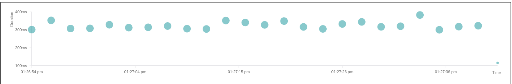
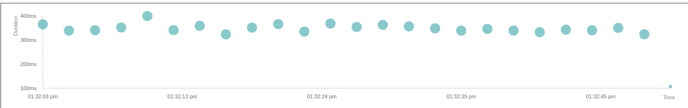

# Kafka Damero

A Spring Boot library for high-performance, fault-tolerant Kafka message processing. It eliminates boilerplate by providing automatic retries, dead letter queue (DLQ) management, circuit breakers, and batch processing with zero-config resiliency.

## Performance Benchmark

The library is optimized for high throughput and low latency. The following results were achieved during verification with **500,000 messages** (6,000 batch size, 2s window):

### Platform Threads (Default)
**Latency: p50: 360ms | p99: 400ms**


### Virtual Threads (Opt-in)
**Latency: p50: ~380ms | p99: ~430ms**


> [!TIP]
> Use the built-in [Prometheus metrics](file:///home/sam-o-reilly/Downloads/java-damero/prometheus.yml) to monitor these percentiles in your own production environment.

**Enable Virtual Threads:**
```properties
spring.threads.virtual.enabled=true
```

## Key Features

*   **Production-Ready Reliability:** Automatic backoff strategies (Exponential, Linear, Fibonacci, Jitter), DLQ management with full metadata, and crash-safe batch processing.
*   **Operational Excellence:** Built-in OpenTelemetry tracing, Micrometer metrics, and a resilience4j Circuit Breaker.
*   **Zero-Config Deserialization:** Smart type inference for POJOs, primitives, and polymorphic events without strict header requirements.
*   **Developer Tools:** Embedded DLQ Dashboard and REST API for message replay and inspection.

## Quick Start

### 1. Installation

Add the dependency to your `pom.xml`:

```xml
<dependency>
    <groupId>java.damero</groupId>
    <artifactId>kafka-damero</artifactId>
    <version>1.0.4</version>
</dependency>
```

### 2. Basic Configuration

Configure Kafka servers in `application.properties`:

```properties
spring.kafka.bootstrap-servers=localhost:9092
```

### 3. Create a Robust Listener

Annotate your listener with `@DameroKafkaListener`. The library handles the rest.

```java
@Service
public class OrderListener {
    
    @DameroKafkaListener(
        topic = "orders",
        dlqTopic = "orders-dlq",
        maxAttempts = 3,
        delay = 1000,
        delayMethod = DelayMethod.EXPO
    )
    @KafkaListener(topics = "orders", groupId = "order-processor")
    public void processOrder(ConsumerRecord<String, OrderEvent> record, Acknowledgment ack) {
        OrderEvent order = record.value();
        
        // Your business logic
        processPayment(order);
        
        // Acknowledgement is managed automatically on success
        ack.acknowledge();
    }
}
```

## Flexible Deserialization

The library uses a smart deserializer that adapts to the payload, removing the need for strict producers.

### 1. Zero-Config Type Inference
The library infers the expected type from your `@KafkaListener` signature.
*   **POJOs:** Auto-deserialized to your class (e.g., `OrderEvent`).
*   **Primitives:** Raw JSON values (`true`, `123`) map to `Boolean`, `Integer`, etc.
*   **No Headers Needed:** Works with producers (Python, Node.js) that do not send Java `__TypeId__` headers.

### 2. Polymorphic Consumers
To accept multiple message types in a single consumer, use `ConsumerRecord<String, Object>`:

```java
@KafkaListener(topics = "mixed-events")
public void handleMixed(ConsumerRecord<String, Object> record) {
    if (record.value() instanceof OrderEvent) { ... }
    else if (record.value() instanceof UserEvent) { ... }
}
```

### 3. Transparent Event Wrappers
DLQ messages are internally wrapped with metadata (attempts, timestamps). When replayed to your consumer, the library automatically unwraps them, so your listener always receives the original domain object.

## Processing Modes

### Batch Processing
Optimized for high throughput (10x-50x faster). Messages are acknowledged only when the full batch succeeds.

```java
@DameroKafkaListener(
    topic = "analytics",
    batchCapacity = 5000,       // Process when 5000 messages accumulated
    batchWindowLength = 10000,  // Or every 10 seconds
    fixedWindow = false         // false = Max Throughput, true = Predictable Rate
)
```


## Resilience & Observability

### Distributed Tracing (OpenTelemetry)
Get full visibility into retries, DLQ routing, and batch latency.

1.  Add `opentelemetry-sdk` and `opentelemetry-exporter-otlp` dependencies.
2.  Enable in annotation: `openTelemetry = true`.
3.  Configure exporter in properties: `otel.exporter.otlp.endpoint=http://localhost:4317`.

### Conditional DLQ Routing
Route specific exceptions to dedicated DLQ topics (e.g., maintain strict ordering for timeouts but separate validation errors).

```java
dlqRoutes = {
    @DlqExceptionRoutes(exception = ValidationException.class, dlqExceptionTopic = "dlq-invalid", skipRetry = true),
    @DlqExceptionRoutes(exception = TimeoutException.class, dlqExceptionTopic = "dlq-retry", skipRetry = false)
}
```

### Circuit Breaker
Automatically stop processing when error rates spike.

```java
enableCircuitBreaker = true,
circuitBreakerFailureThreshold = 50, // Open circuit after 50 failures
circuitBreakerWaitDuration = 60000   // Wait 60s before half-open check
```

## Management Dashboard

Visual interface for inspecting and replaying DLQ messages.

*   **URL:** `http://localhost:8080/dlq/dashboard`
*   **API:**
    *   `GET /dlq?topic={topic}`: List messages
    *   `POST /dlq/replay/{topic}?forceReplay=true`: Replay all messages
    *   `POST /dlq/replay/{topic}?skipValidation=true`: Replay ignoring validation

## Infrastructure Support

### Redis Caching (Optional)
For multi-instance deployments, the library supports Redis for distributed deduplication and retry tracking. It degrades gracefully to local Caffeine cache if Redis is unavailable.

```properties
spring.data.redis.host=localhost
spring.data.redis.port=6379
```

### Auto-Configuration
The library follows Spring Boot standards. You can override any internal bean (e.g., `retryOrchestrator`, `dlqRouter`) by defining your own with the same name. Disable auto-configuration if needed:
`custom.kafka.auto-config.enabled=false`
